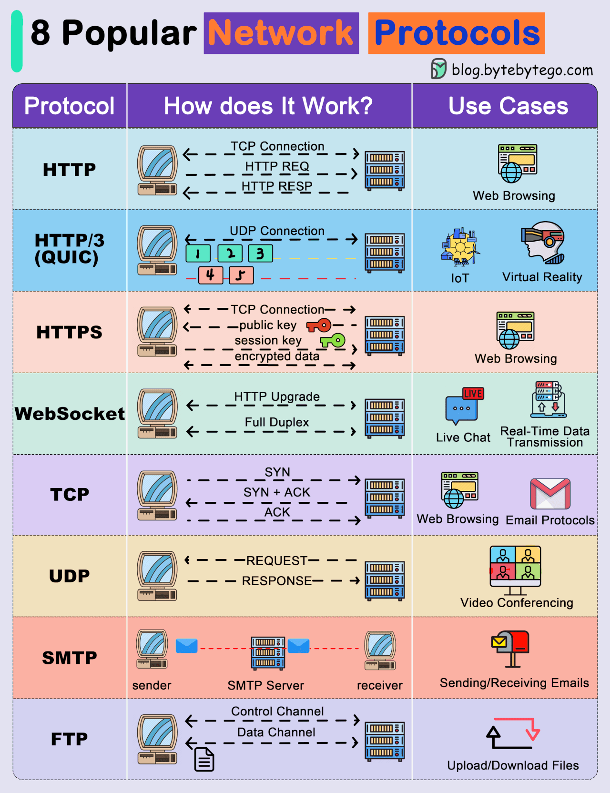

# Communicatoin Protocols

1. HTTP - Hypertext Transfer Protocol
2. HTTP/3 -
3. HTTPS - Hypertext Transfer Protocol Secure
4. WebSocket
5. TCP - Transmission Control Protocol

-

6. UDP - User Datagram Protocol
7. SMTP - Simple Mail Transfer Protocol
8. FTP - File Transfer Protocol
