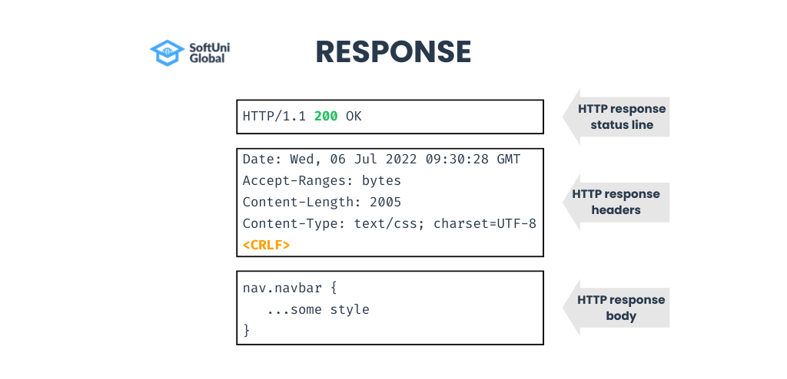
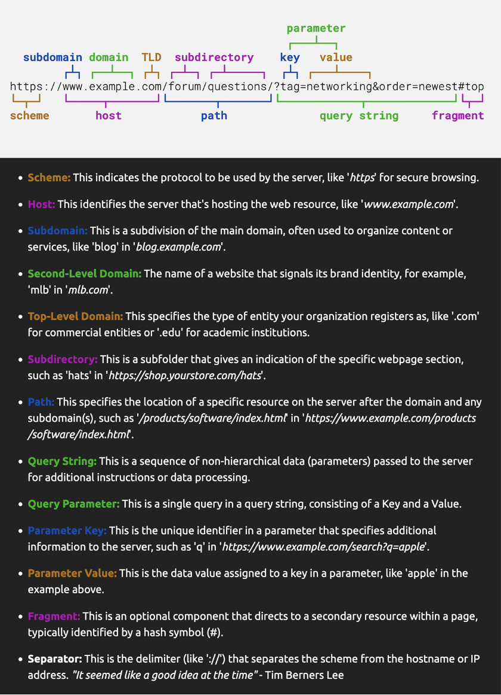

# Rest APIs

Overview

- Rest API
- Why rest api?
- Building blocks
  - url
  - methods
  - headers
  - request/response
  - status code
- Build App
- Postman
- HTTP 1/2/3
- Best Practices
- Advanced (headers, versioning)

## How to Add/Create npm package

- npm init
- change require to import using type='module'

## Architecture

- 1-tier architecture
  description: both the frontend and backend are hosted on a single server.
  example: a standalone desktop application.

- 2-tier architecture
  description: the frontend is hosted on one server, and the backend along with the database is hosted on another server.
  example: a client-server application where the client interacts directly with the database server.

- 3-tier architecture
  description: the frontend, backend, and database are each hosted on separate servers.
  example: a web application where the user interface is served from a web server, business logic is handled by an application server, and data is stored in a database server.

## API protocols and architecture

1. REST - Representational State Transfer
2. graphQL
3. gRPC
4. Soap

## REST & HTTP

1. REST - provides a set of rules, principles, and constraints for building scalable web services.
2. HTTP - Protocol defining how an api are formatted and transmitted between web servers and browsers.

Benifits of REST

- ease of use
- stateless
- scalability
- flexibility with data
- uniform interface (uniform resource locater)
- caching
- seperation of concerns
- interoperability - lanuage agnotic
- ease of testing
- security (http auth headers)

## Building blocks

# URL(uniform resource locator) Parts

Note: Fragment is the only thing in the entire url that is not sent to the server

## Methods

1. post
2. get
3. put - to update entire data
4. patch - to update a part of data
5. delete
6. head
7. options
8. connect
9. trace

## Headers

1. Request header

|     | Header            | Use case                                                   | Example               |
| --- | ----------------- | ---------------------------------------------------------- | --------------------- |
| 1   | Host              | target host                                                | host: 1.example.com   |
| 2   | Origin            | origin host                                                | host: www.example.com |
| 3   | Referer           | Indicated the prev. web page making this req               | host: www.xyz.com     |
| 4   | User-Agent        | Send client related info., identify client,ex: OS, browser | Mozilla/5.0...        |
| 5   | Accept            | Represent content type (what kind of req we can accept)    | application/json      |
| 6   | Accept-Language   | Preferred response content language                        | en-vs, en:q=0.9       |
| 7   | Accept-Encoding   | Encoding algorithm                                         | gzip,deflate,br       |
| 8   | Connection        | Keep TCP connection open                                   | keep-alive, close     |
| 9   | Authorization     | Send credentials                                           | Authorization: Bearer |
| 10  | Cookie            | Prev. server token can be resend                           | key=value             |
| 11  | If-modified-since |                                                            |                       |
| 12  | Cache-Control     |                                                            |                       |

2. Response header

|     | Header           | Use case                                              | Example               |
| --- | ---------------- | ----------------------------------------------------- | --------------------- |
| 1   | Date             | when the res get generated                            | host: 1.example.com   |
| 2   | Server           | provides server info                                  | host: www.example.com |
| 3   | Content-Type     | type of response content                              | host: www.xyz.com     |
| 4   | Content-Length   | original body res length                              | Mozilla/5.0...        |
| 5   | Set-Cookie       | inform about cookie need to store for future response | application/json      |
| 6   | Content-Encoding | Response content encoding                             | en-vs, en:q=0.9       |
| 7   | Cache-Control    |                                                       |                       |
| 8   | Last-Modified    |                                                       |                       |
| 9   | Etag             |                                                       |                       |
| 10  | Expires          |                                                       |                       |

## Status codes

https://www.restapitutorial.com/httpstatuscodes
