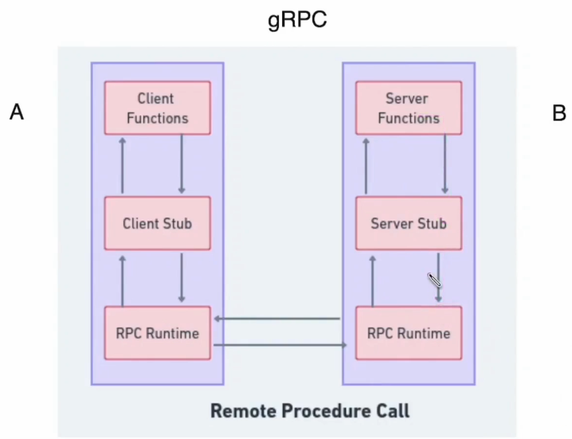
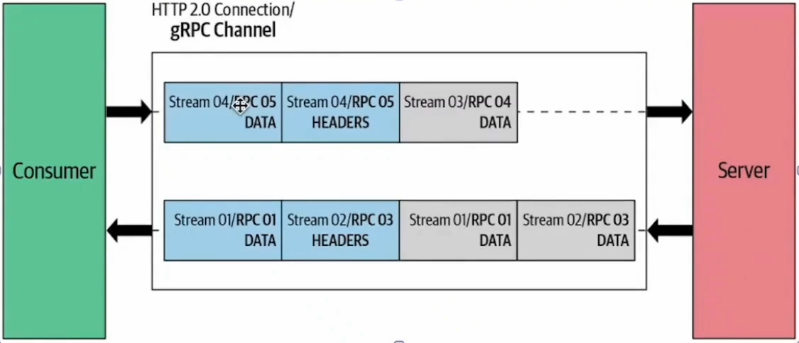
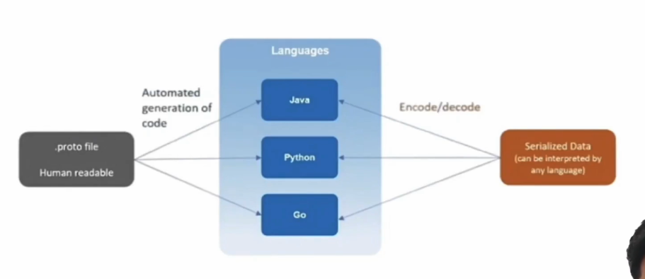
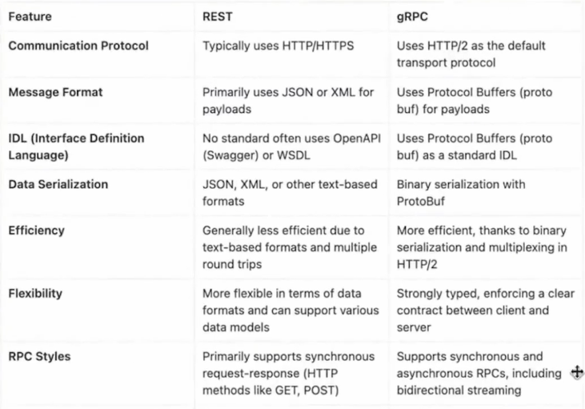
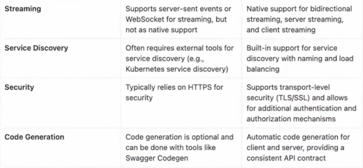
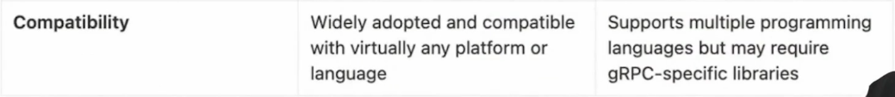
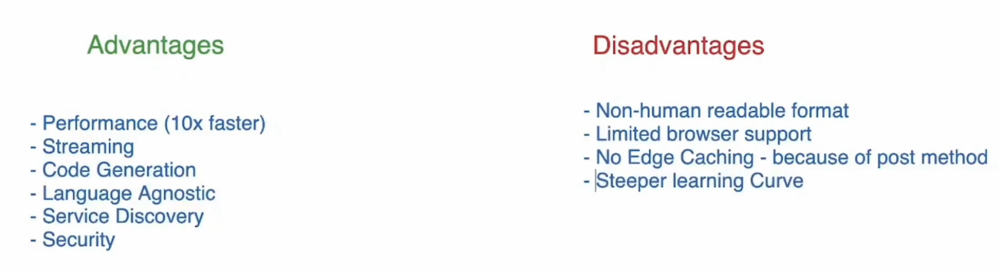

# gRPC

- gRPC (Remote procedure call)
- open source
- grpc is a framework built on top of rpc
- communication happens using protocol buffer (protoBuf) - IDL (Interface definition language)
- HTTP2
- protocol serialization
- single long live connection
- bidirectional streaming
  
- protocol buffer
  - IDL
  - serialization/deserialization
  - binary support
  - .proto(proto3)
    
  - benifits
    - uses less cpu resources (mobile)
    - faster (because of binary data - travel faster on network layer)

# Rest vs gRpc

# Advantage vs disadvantage

