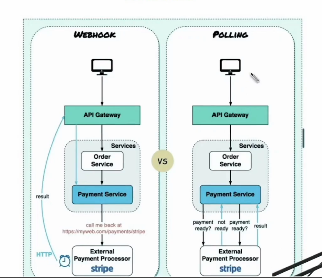

# Webhooks

- Real time communication
- Event Driven
- POST Rest API (payload, authorization secret)
- Retry
- Verification/Acknowledge
- Use cases
  - Notificaiton sytem
  - Data synchronization
  - Automation

