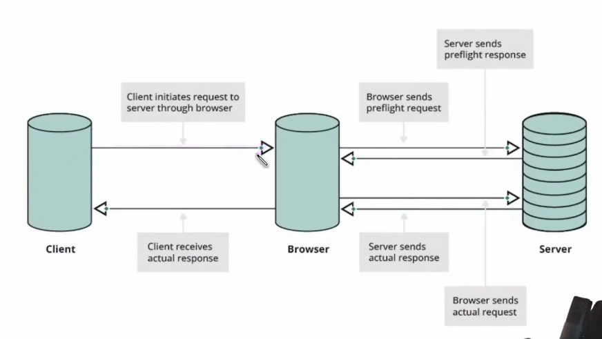
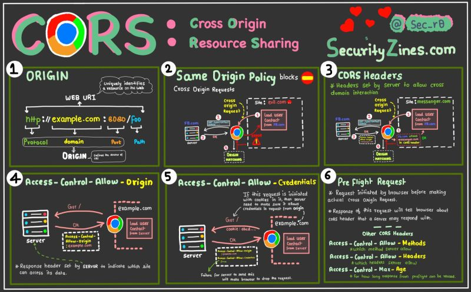

# Cross Origin Resource Sharing

- Same origin policy (SOP)
- Cross origin request (different - protocol, port, subdomain, domain)
- CORS Headers
  - Access-control-allow-origin
  - Access-control-allow-methods
  - Access-control-allow-headers
  - Access-control-allow-credentials
  - Access-control-expose-headers
