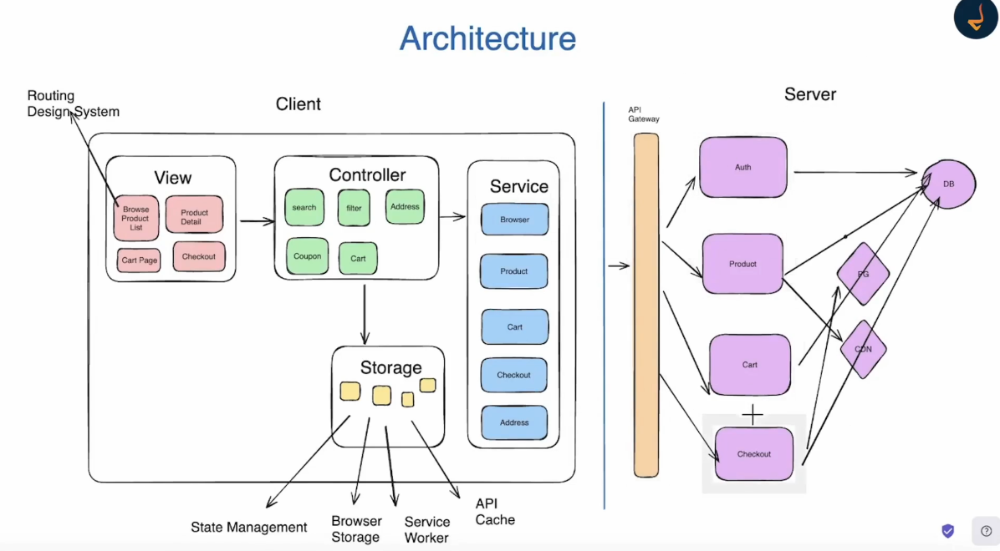
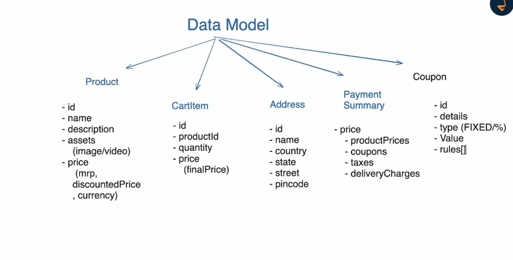

# E Commerce app

1. Configurable ui
2. Browse and purchase
3. Requirements
   - Functional requirements
     - Browse product
       - Search
       - Filters
       - Product listing page
       - Product details page
     - Add to cart
       - Cart page
       - Change quantity
       - Price summary
     - Purchase product
       - Checkout page
       - Address
       - Apply coupon
       - price breakup
   - Non-Functional requirements
     - Device support (responsiveness)
     - Auth
     - i18/i10n
     - SEO
     - Optimization
     - Security
     - Accessibility
     - Deployment
     - Offline Support
4. Architecture
   
5. Data Model
   
6. API
   - Product List (search + filter) (offset based pagination or cusor based pagination)
   - Cart update ( add,delete,chaneg, quantity)
   - Cart Listing
   - Coupon List
   - Price summary
   - PG related api
7. Optimization
   - Lazy loading & code splitting
   - ATF (Above the fold)
     - defer/async
     - prefetch
   - webp
   - cdn/service worker
   - lazy loadin images
   - image priority
   - DPI (device pixel)
   - Adaptive loading
8. SEO
   - <title></title>
   - sitemap.xml
   - robots.txt
   - canonical
   - semantics (h1, section, nav, header, footer)
   - Better page speed - better indexing
   - SSR is better
   - SSG is better
   - CSR is not good (use alternative)
     
   - Sharable links
     - search/filter should be part of url
   - Readable URl links
9. Internationalization/Localization
   - <html lang='zh-cn' />
   - <link ref="alternate" hreflang="en" href="..." />
   - hreflang > a, link
   - <link rel="alternate" hreflang="x-default" href="..." />
   - RTL (language for right to left or left to right)
     - dir (direction)
     - logical css properties (flex)
     - :lang() css properties
   - Capability to change language
   - Formatting currency & dates
   - Form validation > min/max length, localize error message
   - Don't concatenate string
   - Rest API: Use header Accept-Language
   - utf-8
