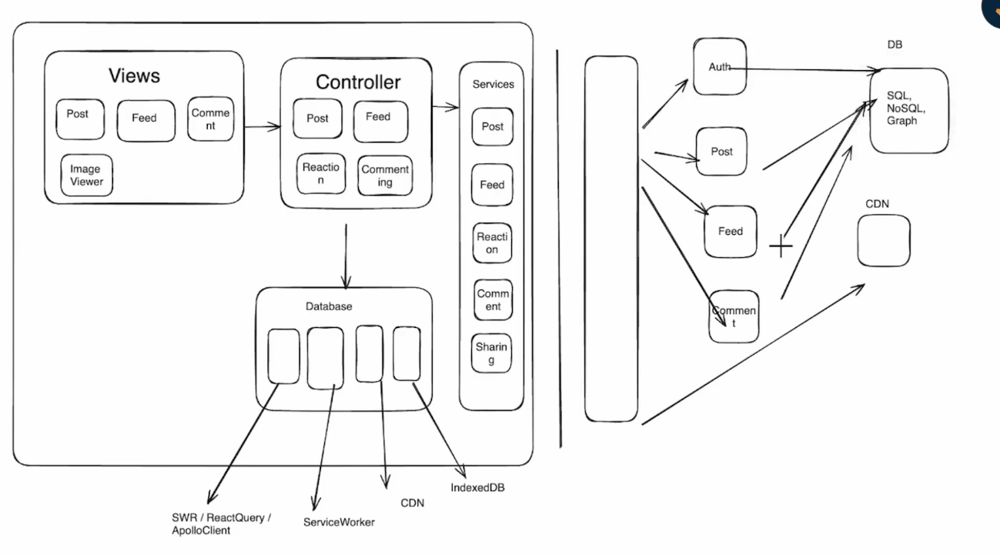
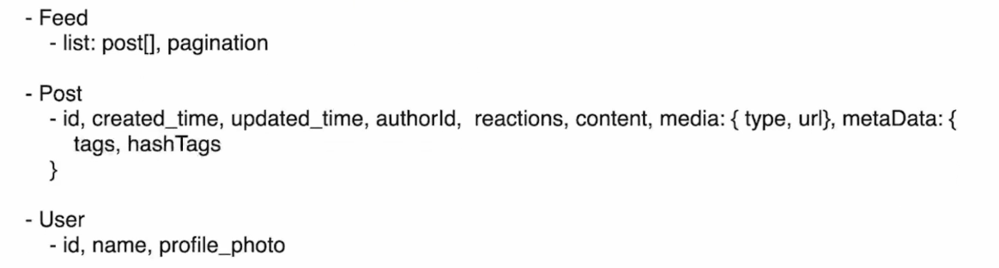

# News Feed

1. Requirements
   - Functional Requirements
     - Create post and publish
       - Text, image
       - Tagging
       - Hashtag
     - Liking & reaction
     - Comments
     - Share
     - Browser
   - Non Funcitonal Requirements
     - Device support
     - Optimizatin
     - SEO
     - Loggin and monitoring
     - Security
     - database & caching
     - Infinite scroll
     - WYSIWYG editor
     - Rendering approach
2. Architecture
   
3. Data model
   
4. Implementation details
   - Rendering approach
     - SSR, CSR
   - Infinite Scroll (pagination)
     - Offset based {size, page, total posts}
     - Cursor based {cursor,size}
   - Infinite loading
     - Scroll event
     - Intersection observer api
   - Virtualization
     - less browsing painting
     - light-weighted real dom
   - Shimmer ui
     - svg
     - css3
     - gif
   - Perserving scroll position
     - SPA > Cached data > no server trip
   - Mention & hashtags
     - Input/Textarea X
     - div > contenteditable=true
     - div > WYSIWYG editor
       - (draft.js,slate.js)
       - XSS attack
     - Hastags > #learnwithchirag, mention > [[#userId123: chirag]]
   - Optimistic update
     - swr, react query, apollo client
   - timestam rendering
     - server
     - client (UTC), INTL library
     - Relative time rendering
   - Icon rendering
     - SVG
     - Separate images
     - Font icon
     - Spirite images
   - Image rendering
     - CDN
     - WebP
     - scrset
     - prefetch/low-resolution image loading
   - Commenting
     - recursion (depth)
     - cursor based paginaition
     - optimistic
     - lasy loading (emoji, mentions, tag)
