# How the web works

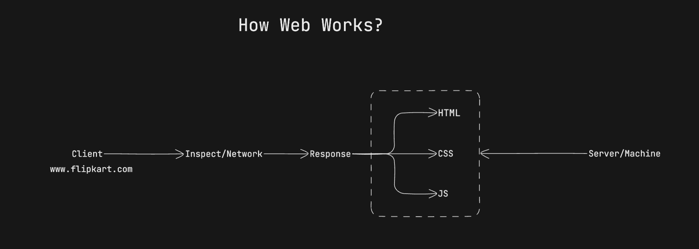
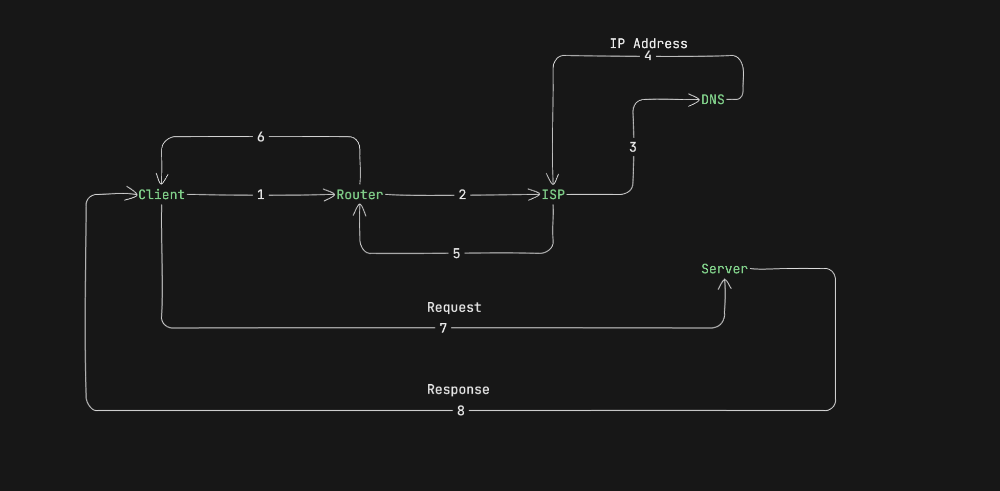

- If there's no change, the server will send the HTTP 304 response code.
  The HTTP status code 304 signifies Not Modified, indicating the server found no changes in the requested page
  since your last visit. After that, your browser will retrieve the cached version of the web page in your local storage.
- When an application make a network request there can be max 6-8 request made paralley depending upon the browser.
  Anything after that is queued.

1. DNS

- Domain name server
- Phone book of internet
- Contain name & ip address
- ICANN decides guidlines
- WHOIS.com - privacy protection

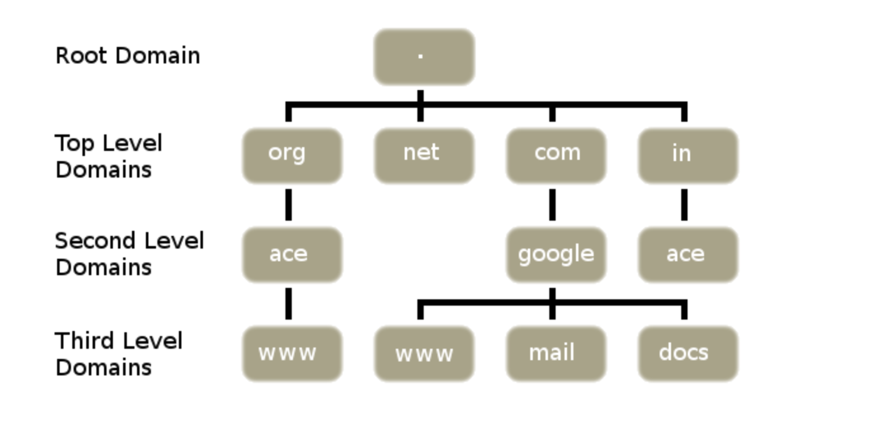

2. ISP

- Internet Service Provider

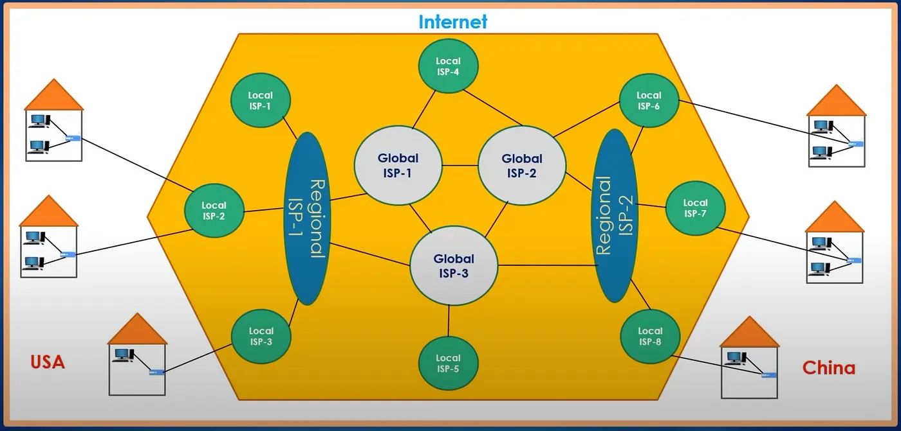

3. Client & Router

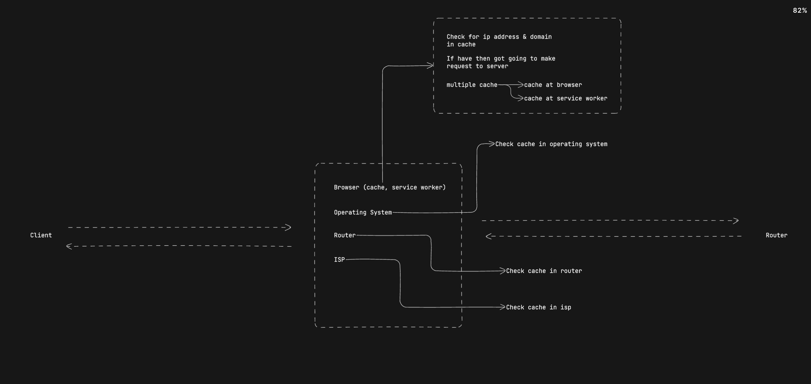

3. ISP & Server

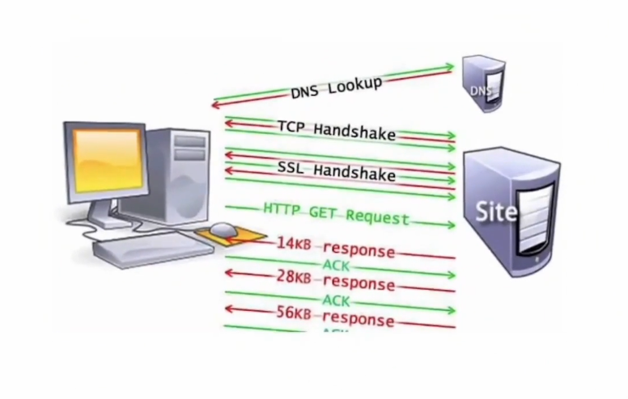
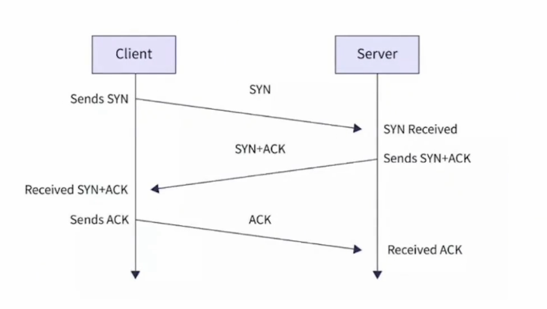

4. How a web page renders?

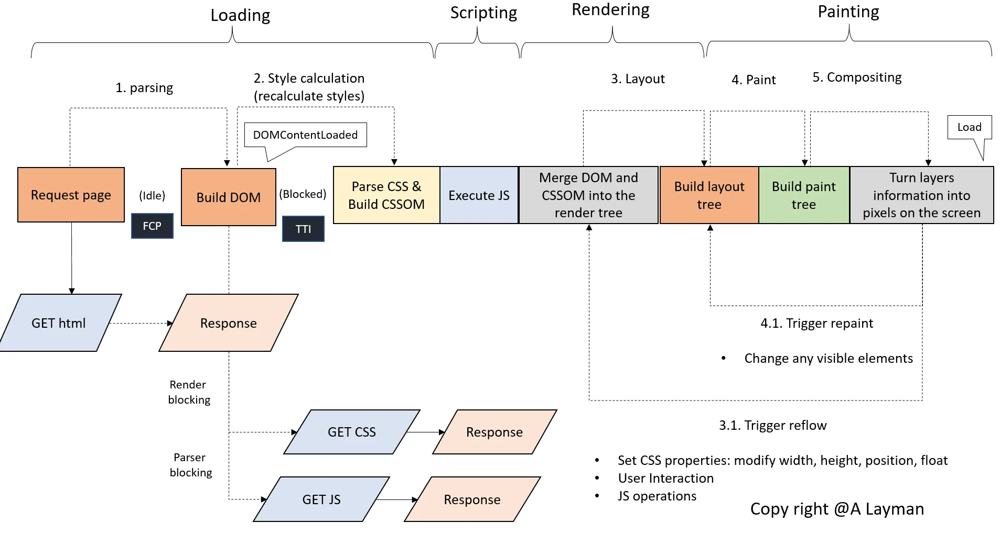

- Rendering blocking - untils css is loaded it is not going to show anything in ui. (blocks rendering)
- Parser blocking - untils a moment if its get the blocking js it will halt your blocking js. It won't let executing go to below lines

5. CSS & CSSOM Tree

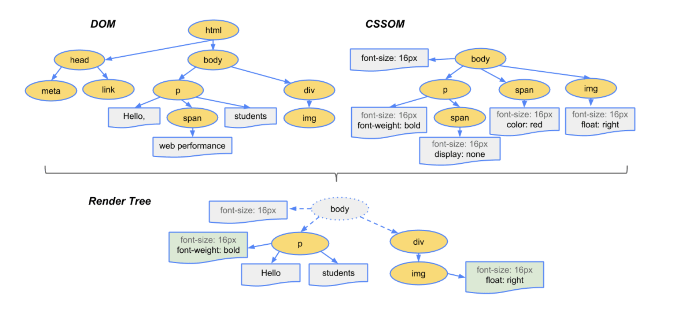

6. Html parcing

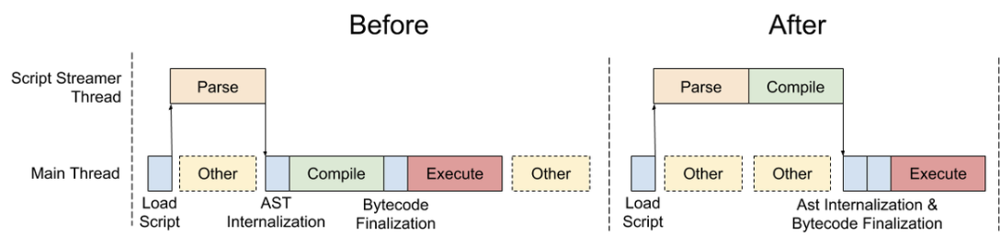

7. Rendering Steps

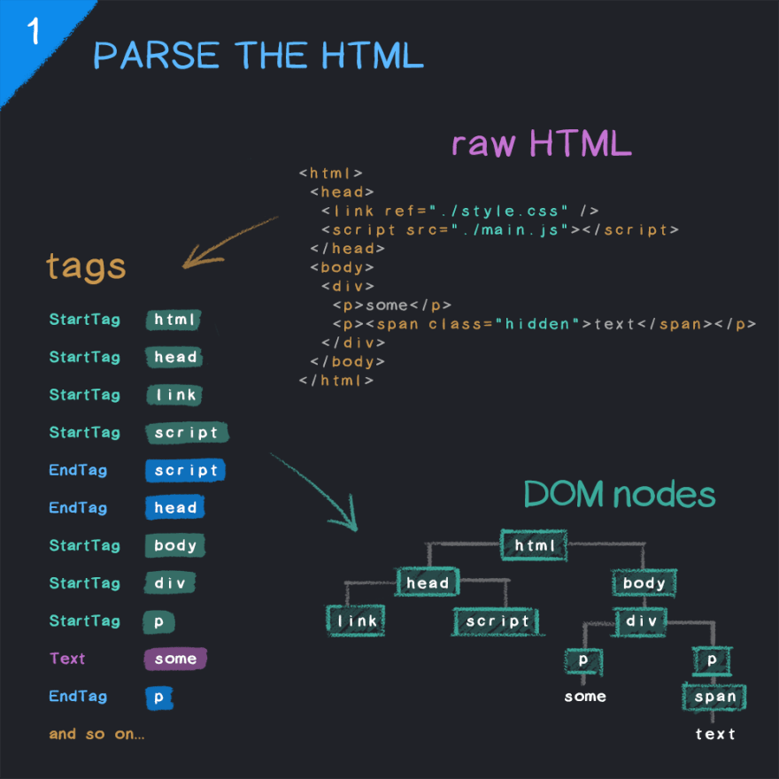

#
