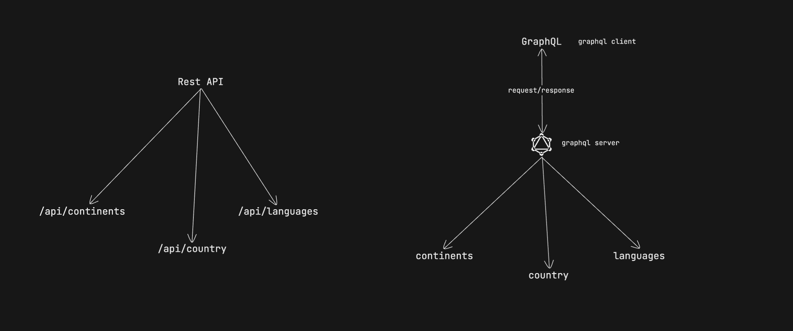
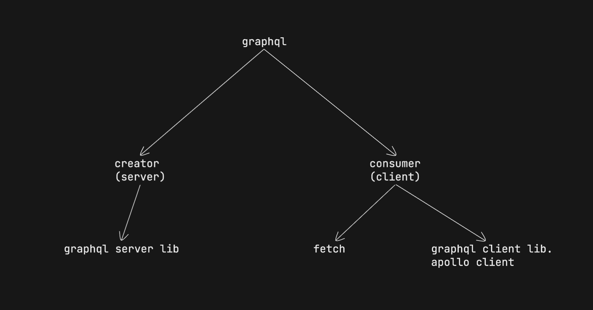
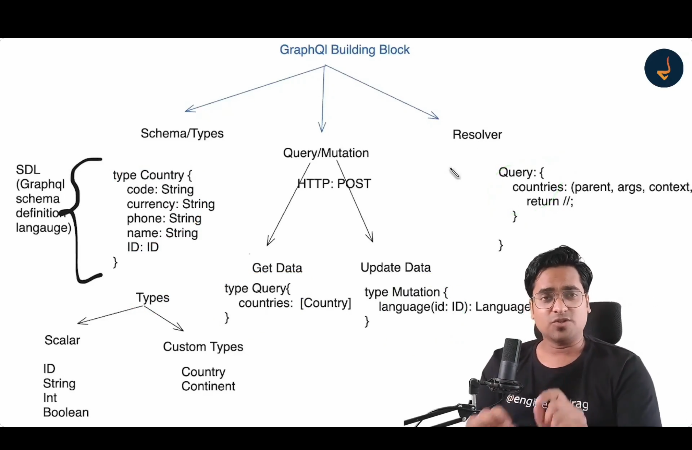

# GraphQL

Overview

- What is graphql?
- benifits
- rest vs graphql
- building blocks
- build graph app
- calling graph from client
- tool
- advanced

# graphql

- follow same http protocol as rest api but also provide additional features such as topics

# benifits

1. avoid over-fetching (fetch only required data)
2. avoid under-fetching (fetch multiple data in single shot)
3. better mobile performance because mobile have
   - less capacity
   - less ram
   - less rom
   - less hardware support than pc
4. efficiency & precision
5. declarative & precision
6. structural/hierarchical structure
7. strongly typed
8. introinspection (provide all the document)
9. real time capabilities > subscription

# rest vs graphql

|     | Aspect                       | Rest                         | graph                                                          |
| --- | ---------------------------- | ---------------------------- | -------------------------------------------------------------- |
| 1   | data fetching                | multiple endpoint            | single enpoint                                                 |
| 2   | req structure                | fixed structure,http methods | flexible (query/mutating)                                      |
| 3   | over fetching/under fetching | Issue                        | Resolved                                                       |
| 4   | response size                | fixed                        | flexible                                                       |
| 5   | versioning                   | explicit versioning          | flexible nature                                                |
| 6   | schema definition            | not well defined             | explicit schema                                                |
| 7   | real time capabilites        | polling,websocket            | out of scope support (subscription)                            |
| 8   | tooling support              | postman                      | playground                                                     |
| 9   | caching                      | relise on http               | fine grained, can be controlled on client using lib. on client |
| 10  | client control               | no client                    | yes client can decide                                          |
| 11  | adoption & community         | widely adopted               | rapidly growing                                                |

# fundamental of graph

