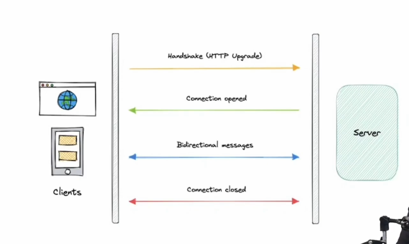

# Websockets

- use ws/wss (web socket/web socket secure) over http/https
- Full Duplex communication
- Single long live tcp connection
- Continuous bi-directional communication
- Use Cases
  - Analytics
  - Financial Trading
  - Online gaming
  - Collab
- Uses
  - if message is small can go directly
  - if message is long it go in small small frames(called framming)
  - 101 switching protocol
- Challenges
  - Resource usages
  - Connection limits
  - Sticky sessions
  - Load balancer
  - Authentication
  - Firewall/Proxy
  - Cache
  - Testing/Debugging
  - Backward compatibility
  - Resources cleanup
  - Connection drop

