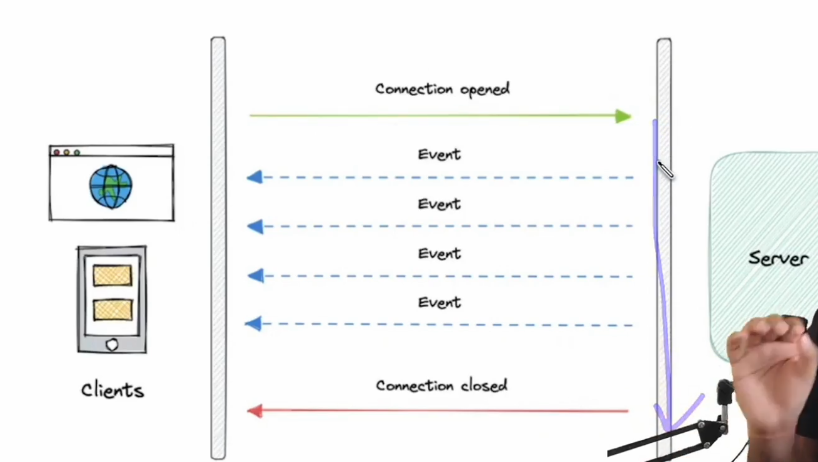

# Server Sent Event

- Long live unidirectional communication
- Single HTTP connection
- Connectin: keep-alive
- event-stream
- event | data | id
- Examples
  - Feeds
  - notification
  - monitoring
  - dashboard
- Challenges
  - Browser Compatibility
  - Connection limit
  - Connection timeout
  - Background tab behaviour
  - Resource utilization
  - Load balancer
  - Sticky connection
  - Proxy/Firewall
  - Testing
  - Broadcasting

