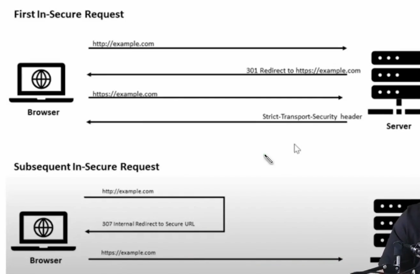

# Secure Communication (HTTPs)

- Data Encryption between client > encrypted data > server (Uses Transport Layer Security)
- Authentication (SSL & TLS)
- Data Integrity (MAC - Message authentication code)
- Protection Against Phishing
- Data Privacy
- Compliance with security standards
- Trust and Reputation
- Search Engine Ranking
- Protection against browser warnings (when certificate expires then browser show warning)
- Faster website loading (HTTP2)
  - Modern browsers only support HTTP/2 over a secure connection (HTTPS)
