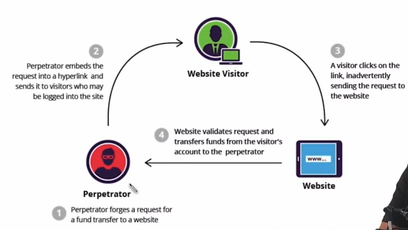

# Cross-site Request Forgery (CSRF)



Reason of CSRF attrack

- Stateless of HTTP
- User authentication

Mitigation

- Anti-CSRF token
- SameSite Cookies

  ```
    app.use((req,res,next)=>{
        res.setHeader('Set-Cookie','SameSite=Strict; Secure');
    })

    SameSite = None | Lax
  ```

- Referer-based validate
- Use captcha
- CSP Header
- Don't use get method for update operation
