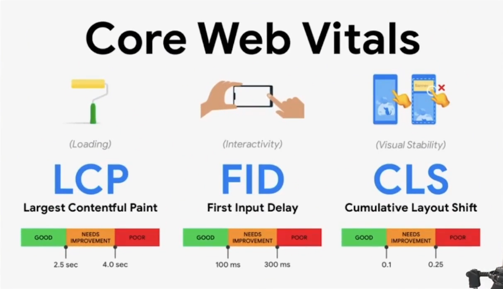
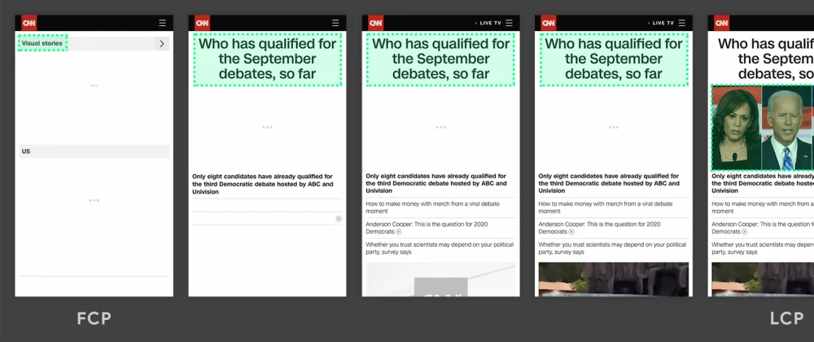
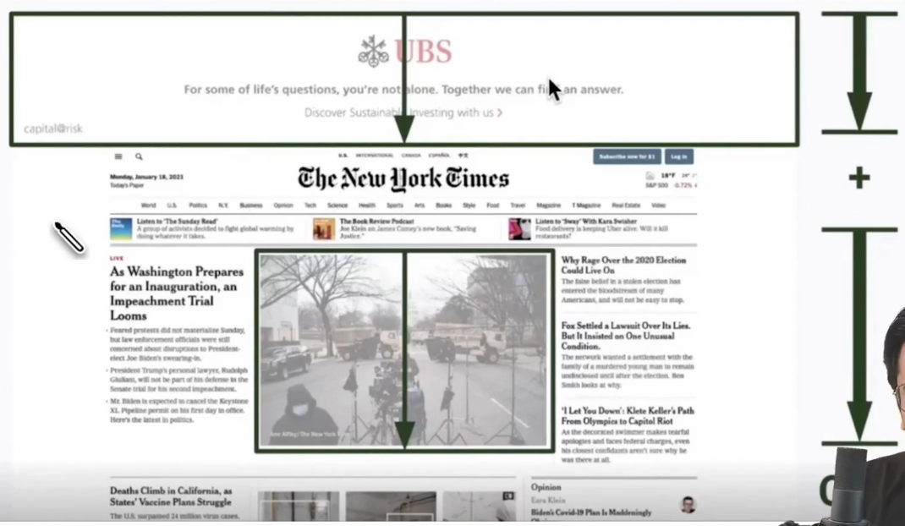
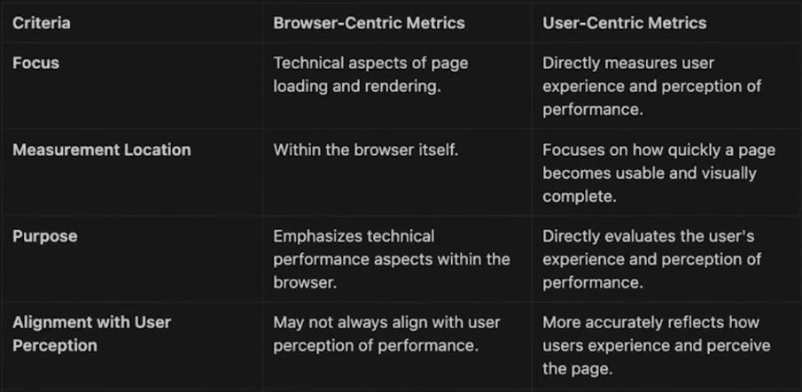
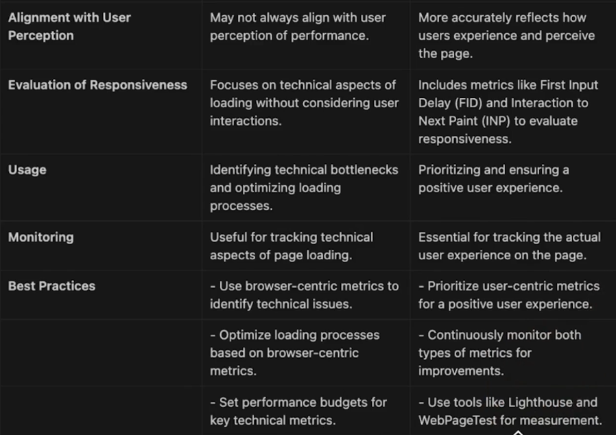

# Performance Metrics

Out of many web vitals, the core web vitals are

1. LCP
2. FID
3. CLS
4. INP

|     | Browser Centric Metric    | User Centric Metric             |
| --- | ------------------------- | ------------------------------- |
| 1   | Time to first byte (TTFB) | First contentfull paint (FCP)   |
| 2   | Network request           | Largest contentfull paint (LCP) |
| 3   | DNS resolution            | First Input Delay (FID)         |
| 4   | Connection time           | Interaction to next paint (INP) |
| 5   | Dom content loaded        | Total blocking time (TBT)       |
| 6   | Page load event           | Cumulative layout shift (CLS)   |

