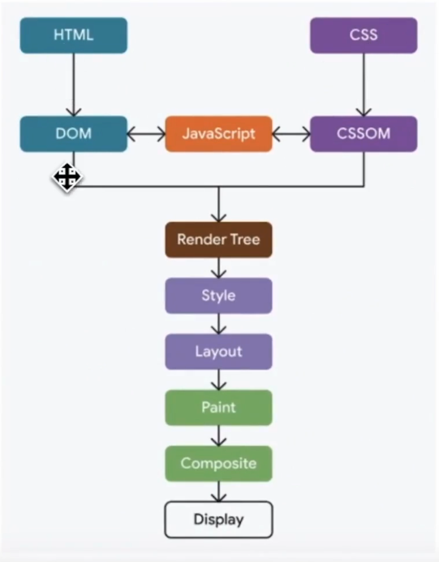
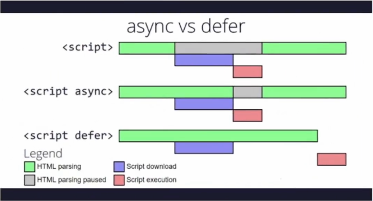
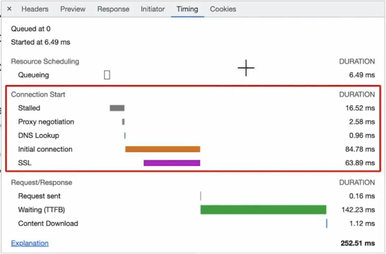
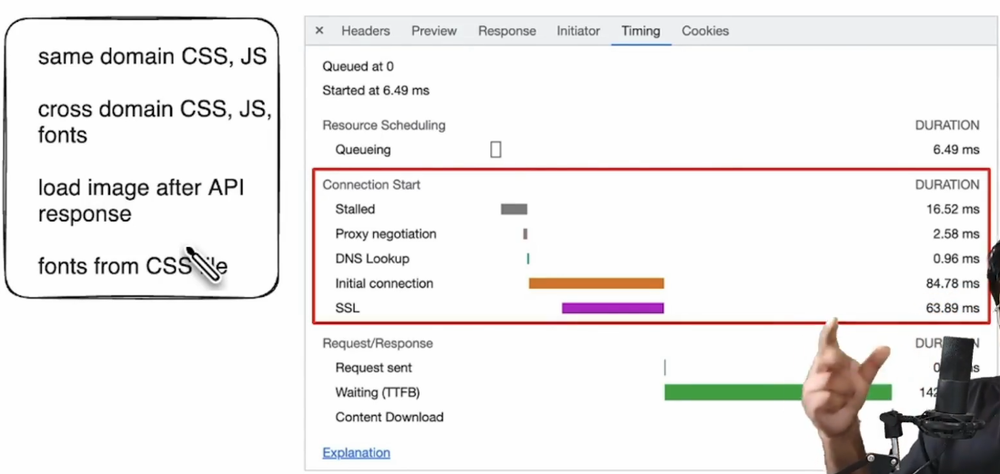
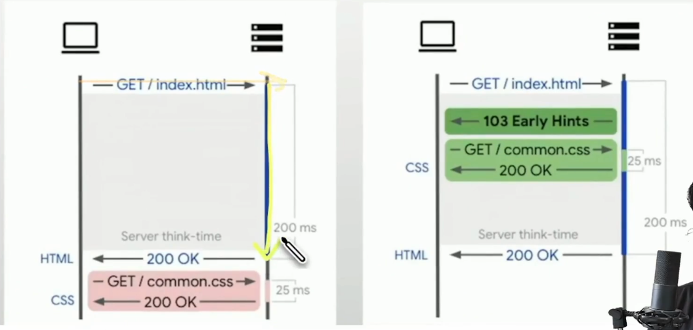
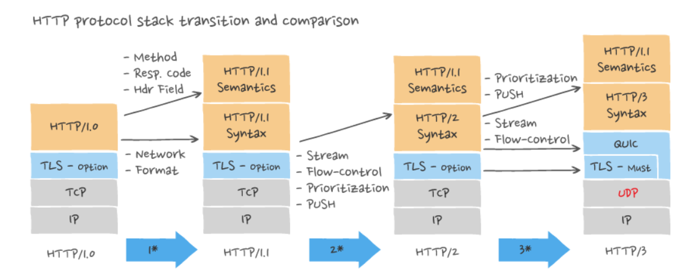
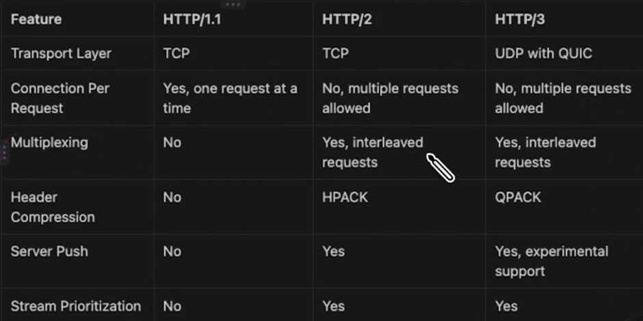

# Network Optimization

1. Critical rendering path
2. Minimize the http requests
3. Async loading of js: async/defer
4. Avoid Redirection
5. Resource Hinting
6. Fetch Priority
7. Early Hints
8. HTTP upgrade methods (http1 vs http2 vs http3)
9. Compressions
   - brotli
   - gzip
10. HTTP caching
    - Cache control
11. Caching using service worker

## Critical rendering path

- CSS - render blocking
- Javascript - parsing blocking
- First packet - 14kb

## Minimize the http requests

Challenges

- Connection time (tcp, ssl)
- Browser limit per domain(6-10 max parallel calls can be made)

Solution

- Inline css
- Inline js
- Base 64
- SVG for images

## Async/Defer Javascript

## Avoid Redirection

- Avoid redirection from http to https
- hstspreload.org

## Resource Hinting

- lean-performance-resource-hints.glitch.me
- preconnect(connect to specific cross server in advanced)
    <link rel="preconnect" href="https://fonts.gstatic.com" crossorigin>
- dns-prefetch(does DNS lookup in advance)
    <link rel="dns-prefetch" href="https://fonts.gstatic.com">
- preload(initiate early request to resource for rendering the page)
    <link rel="preload" href="/font.woff2" as="font" crossorigin>
- prefetch(load resources which are needed in near future with low priority - future navigation)
    <link rel="prefetch" href="/next-page.css" as="style">
- prerender(loads entire page and all its dependency in background which display hidden)
    <link rel="prerender" href="/blog.html">

## Fetch Priority

<!-- Lower priority only for non-critical preloaded scripts -->
<link rel="preload" href="critical-script.js" as="script" >
<link rel="preload" href="/js/script.js"  as="script" fetchpriority="low">
<!-- Preload css without blocking other resources -->
<link rel="preload" href="theme.css"  as="style" fetchpriority="low" onload="this.rel='stylesheet'">

## Early Hints

## HTTP upgrade methods (http1 vs http2 vs http3)

- Compression techniques

  - brotli
  - gzip
  - web.dev/articles/codelab-text-compression-brotli

## HTTP caching

    - Cache Policy (cache-control,expire, etag, last-modified)

## Caching using service worker
