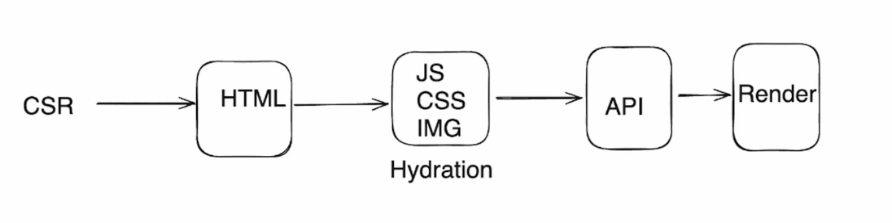
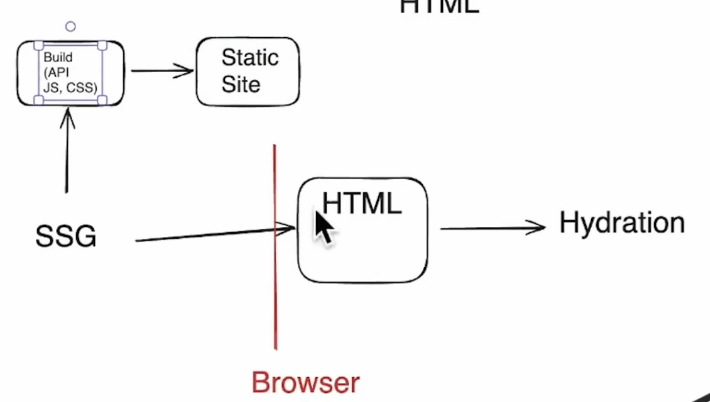
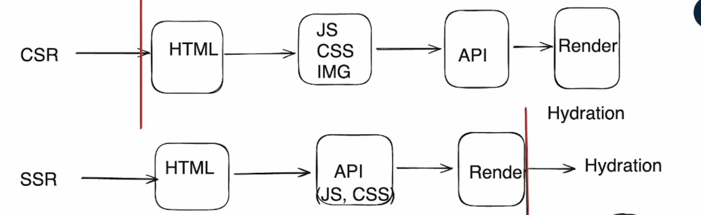
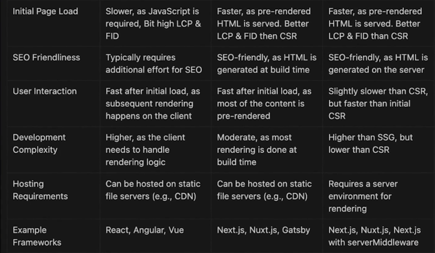
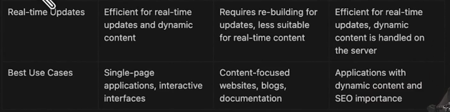

# Rendering pattern

1. Client (CSR - Client side rendering)
2. Server
   - Dyanmic (SSR - Server side rendering)
   - Static (SSG - Static site generation)
3. CSR + SSR
   - React server component
   - Benefits
     - Data fetching
     - Security
     - Caching
     - Bundle size
     - Initial page load
     - Streaming
     - SEO

